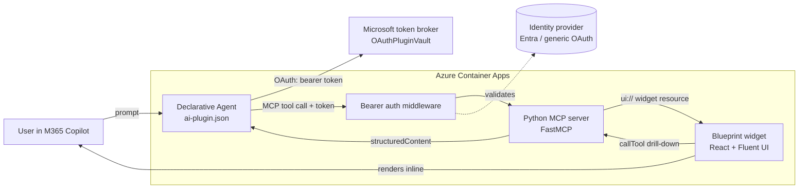

# Copilot MCP App Blueprint

> An end-to-end reference for building a **Microsoft 365 Copilot agent with a rich,
> interactive UI** using the **MCP Apps** pattern — a remote MCP server that both
> serves data **and** renders a React/Fluent widget **inline in Copilot chat**,
> with a clean, ISV-friendly **OAuth sign-in**.

This repo is a working, deployed example you can clone, run, and adapt. The demo
scenario recreates the **Pega Customer Engagement Blueprint** (personas, brand
voice, channel experiences, a value summary) — but the architecture applies to
any data-rich agent that needs more than chat bubbles.

<!-- Replace with a real screenshot/GIF of the widget rendering in Copilot. -->
<!--  -->

---

## Why MCP Apps (vs. Adaptive Cards)

A Copilot agent normally answers in text or simple cards. **MCP Apps** let a tool
return a **full interactive UI** — a single-page React app — that renders inline in
the chat, can go full-screen, and can call back into the server to drill down.

This project started as an Adaptive Cards Custom Engine Agent (now in
[`archive/`](archive/)) and moved to MCP Apps for a far richer, single-surface UX.

| | Adaptive Cards (archived) | **MCP App (this repo)** |
|---|---|---|
| UI | card-by-card JSON | full React/Fluent widget, inline + full-screen |
| Interactivity | submit actions | live drill-down via `callTool`, client state |
| Surface | Teams | Microsoft 365 Copilot |
| Backend | bot + MCP | one MCP server (data **and** UI) |

---

## What you get

- A **Python MCP server** (FastMCP) exposing 7 tools, a UI resource, and public
  export routes (PDF / Excel / importable JSON) — **pure-Python, zero compiled
  deps**, so it containerizes and builds anywhere.
- A **React 18 + Fluent UI v9** widget, built by Vite into a **single self-contained
  HTML file** served as an MCP App resource.
- A **declarative agent package** for Copilot (`appPackage/`).
- **OAuth sign-in** with three selectable modes (anonymous, Entra, or any generic
  OAuth 2 IdP) — see [Security & login](#security--login).
- Reproducible **build + deploy** scripts (Azure Container Apps).

---

## Architecture



**Request flow**

1. The user prompts the agent; Copilot calls an MCP **tool** on the server.
2. If auth is on, Microsoft's token broker attaches the user's **bearer token**;
   the server's middleware validates it before the tool runs.
3. The tool returns `structuredContent` **and** a `_meta.ui.resourceUri` pointing
   at the widget resource.
4. Copilot fetches the widget (`ui://…/app.html`) and renders it **inline**, handing
   it the structured data.
5. The widget can call tools back (`callTool`) to drill down — e.g. open one Action's
   channel treatments — without leaving the chat.

The MCP Apps link is the key convention: every UI tool carries
`_meta.ui.resourceUri`, **on both the tool descriptor and each tool result**, and
the widget is also advertised via `listResourceTemplates` so the host discovers it.

---

## Repository structure

```
.
├── server/            # Python MCP server (FastMCP, uv project)
│   └── pega_mcp/
│       ├── server.py        # bootstrap: resources, tools, auth middleware, export routes
│       ├── tools.py         # 7 tool handlers (+ result _meta.ui.resourceUri)
│       ├── store.py / data.py   # in-memory demo blueprint + view payloads
│       ├── auth.py          # pure-Python bearer validation (Entra JWT or generic userinfo)
│       ├── settings.py      # env-driven config (PEGA_MCP_*)
│       ├── export.py        # pure-Python PDF + openpyxl Excel + importable JSON
│       └── web/widget.html  # built widget (generated; gitignored)
│   ├── Dockerfile           # container image (python:3.11-slim)
│   └── scripts/             # smoke_test, gen_ai_plugin, test_auth
├── widgets/           # React + Fluent UI widget (Vite single-file build)
│   └── src/                 # App.tsx, views/, components/, mcp/McpBridge.tsx
├── appPackage/        # Declarative agent package (manifest, declarativeAgent, ai-plugin)
├── scripts/           # build_package.sh, az_login_mfa.sh, diag_device_code.py
├── env/               # ATK env (.env.dev.example — copy to .env.dev)
├── m365agents.yml     # Microsoft 365 Agents Toolkit lifecycle
├── docs/              # architecture + security/login guides
└── archive/           # the original Adaptive Cards CEA solution (reference only)
```

---

## Quickstart (local)

Prereqs: Python 3.11+, [uv](https://docs.astral.sh/uv/), Node 18+.

```bash
# 1) Build the widget  (→ server/pega_mcp/web/widget.html)
cd widgets && npm install && npm run build

# 2) Run the MCP server  (→ http://localhost:3978/mcp)
cd ../server && uv pip install -e . && uv run python -m pega_mcp

# 3) End-to-end smoke test (another shell)
cd server && uv run python scripts/smoke_test.py
#   or inspect:  npx @modelcontextprotocol/inspector  → Streamable HTTP → http://localhost:3978/mcp

# UI development with mock data:
cd widgets && npm run dev     # http://localhost:5174
```

---

## Deploy to Azure Container Apps

The server is a plain container, so any host works. We use Container Apps with
`min-replicas=1` (no cold starts — important for Copilot's MCP timeouts).

```bash
cd server
az containerapp up \
  --name my-mcp-app --resource-group my-rg --location eastus2 \
  --environment my-cae-env --source . --ingress external --target-port 8000 \
  --env-vars PEGA_MCP_REQUIRE_AUTH=false PEGA_MCP_CORS_ORIGINS='*'

# keep it warm + set the public URL (for export links)
FQDN=$(az containerapp show -g my-rg -n my-mcp-app --query properties.configuration.ingress.fqdn -o tsv)
az containerapp update -g my-rg -n my-mcp-app \
  --min-replicas 1 --max-replicas 3 \
  --set-env-vars PEGA_MCP_PUBLIC_URL="https://$FQDN"
```

> Tip: the server is **pure-Python** on purpose. Avoid compiled deps (pillow,
> cryptography) — they make slim/Oryx-style builds slow and fragile. The PDF
> writer and the JWT/JWKS verification here are both hand-rolled in pure Python.

---

## Sideload in Copilot

```bash
# Point env/.env.dev (copied from the example) at your MCP URL, then:
./scripts/build_package.sh         # → appPackage/build/PegaBlueprintMCP.zip
```

1. Open <https://m365.cloud.microsoft/chat> → **Agents** → **Upload custom agent**.
2. Upload `appPackage/build/PegaBlueprintMCP.zip`.
3. Try: *"Open my customer engagement blueprint"*, then *"show the experiences"*,
   and click an action to drill into its channel treatments.

> Sideloading (custom-app upload) must be enabled in the tenant. Fresh dev tenants
> often disable it by default — see [Security & login](#security--login).

---

## Security & login

Authentication was the deepest part of this project, so it has its own guides:

- **[docs/security-and-login.md](docs/security-and-login.md)** — the concepts, the
  three auth modes, the two registrations (Entra app vs. Teams Developer Portal
  OAuth client), consent, and the recommended ISV pattern.
- **[docs/auth-generic-oauth.md](docs/auth-generic-oauth.md)** — the simplest path,
  including **Entra-as-generic** (Microsoft identity with no admin consent and no
  SSO plumbing) and pointing at your own IdP.
- **[docs/auth-runbook.md](docs/auth-runbook.md)** — the full Entra SSO variant.

**The short version — pick one:**

| Mode | When | Customer-tenant setup |
|---|---|---|
| **Anonymous** | demos, or the MCP server does its own backend auth | none |
| **Generic OAuth 2** (recommended) | sign in to *your* IdP (Pega STS, Okta, GitHub, or **Entra-as-generic**) | one user consent, **no admin** |
| **Entra SSO** | deep Microsoft-tenant integration | app registration + (often) admin consent |

The server enforces auth with a small, streaming-safe ASGI middleware and a
**pure-Python** validator (`server/pega_mcp/auth.py`) — RS256/JWKS for Entra, or a
userinfo call for generic/opaque tokens. Toggle with `PEGA_MCP_REQUIRE_AUTH`.

### The one lesson worth highlighting

Microsoft identity made this *hard* only when we used the **Entra SSO connector**
(app-specific scope + token-store preauthorization + admin consent). Using **Entra
through the generic OAuth 2 connector** — `/common` endpoints with the
user-consentable `User.Read` Graph scope — gives real Microsoft identity with
GitHub-level simplicity: **one user consent, then silent, no admin, multi-tenant**.
That is the recommended pattern for an ISV. Details in
[docs/security-and-login.md](docs/security-and-login.md).

---

## Configuration reference (`PEGA_MCP_*`)

| Env var | Default | Purpose |
|---|---|---|
| `PEGA_MCP_REQUIRE_AUTH` | `false` | Enforce bearer auth on `/mcp` |
| `PEGA_MCP_AUTH_MODE` | `entra` | `entra` (JWT) or `generic` (userinfo) |
| `PEGA_MCP_OAUTH_USERINFO_URL` | — | generic mode: e.g. `https://graph.microsoft.com/v1.0/me` |
| `PEGA_MCP_ENTRA_TENANT_ID` | — | entra mode: tenant GUID, or `common`/`organizations` |
| `PEGA_MCP_ENTRA_AUDIENCES` | — | entra mode: accepted token audiences (CSV) |
| `PEGA_MCP_ENTRA_REQUIRED_SCOPE` | — | optional required scope |
| `PEGA_MCP_OAUTH_SUBJECT_FIELD` | — | generic mode: claim to use as identity (e.g. `userPrincipalName`) |
| `PEGA_MCP_OAUTH_ALLOWED_SUBJECTS` | — | generic mode: optional allowlist of subjects |
| `PEGA_MCP_PUBLIC_URL` | — | base URL for export download links |
| `PEGA_MCP_CORS_ORIGINS` | `*` | CORS allow-list |

---

## References

- [MCP Apps in Copilot chat](https://devblogs.microsoft.com/microsoft365dev/mcp-apps-now-available-in-copilot-chat/)
- [Plugins for Microsoft 365 Copilot](https://learn.microsoft.com/microsoft-365/copilot/extensibility/overview-plugins?tabs=mcp)
- [Configure authentication for MCP and API plugins](https://learn.microsoft.com/microsoft-365/copilot/extensibility/plugin-authentication)
- [Microsoft interactive-UI MCP samples](https://github.com/microsoft/mcp-interactiveUI-samples)
- [Model Context Protocol](https://modelcontextprotocol.io/)

## License

[MIT](LICENSE). Demo data is illustrative and not affiliated with or endorsed by Pega.
