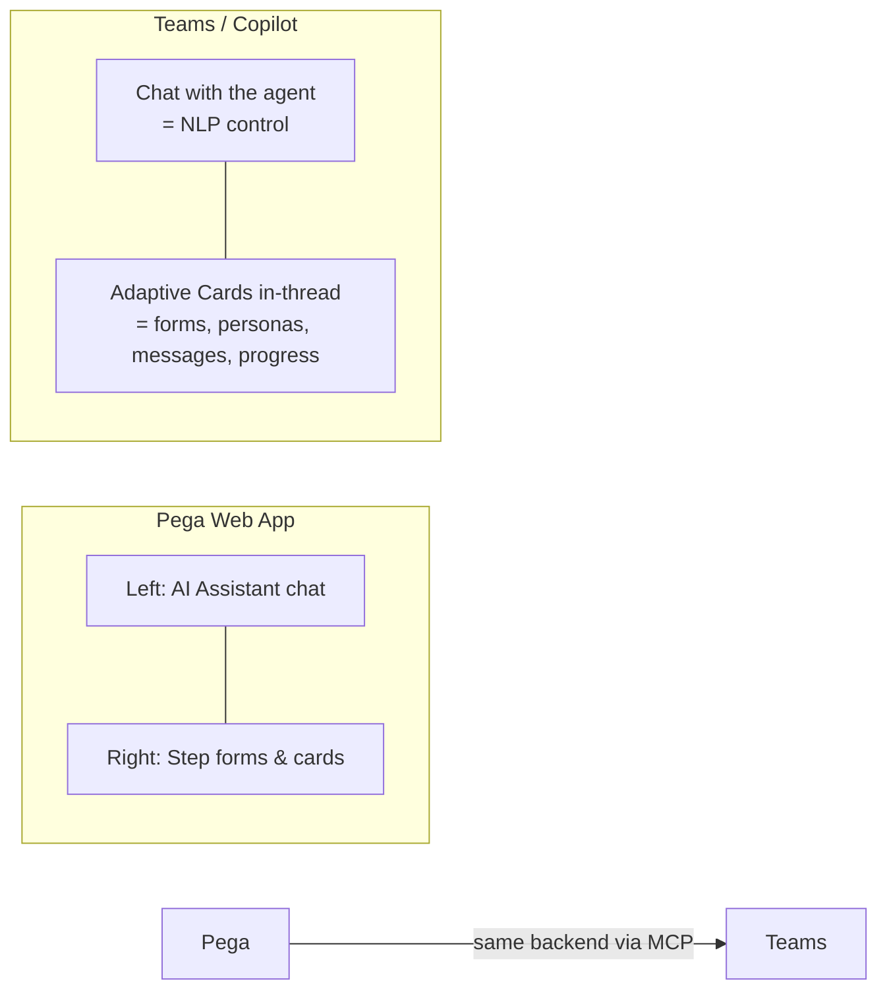
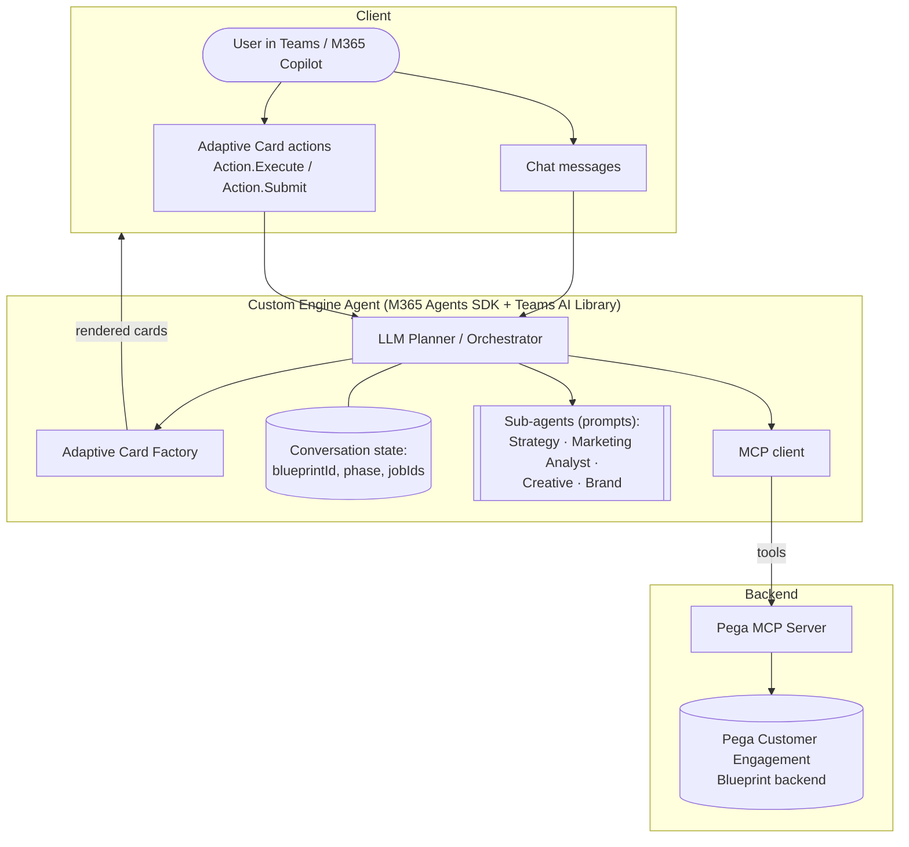
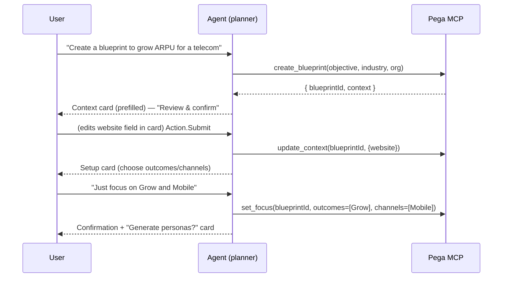
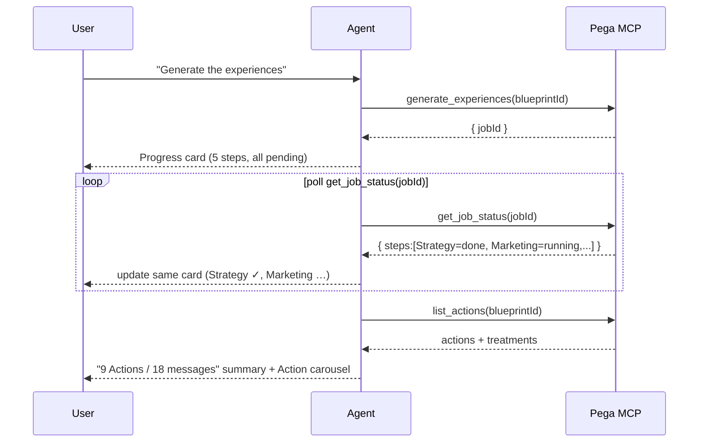
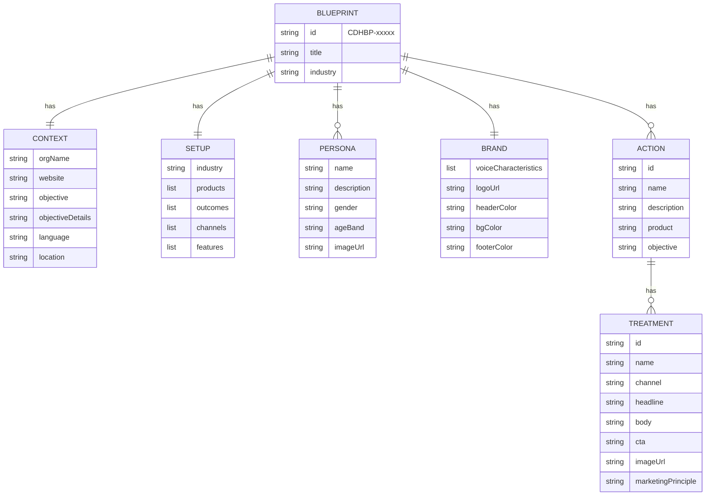

# Design: Pega Engagement Blueprint as a Teams/Copilot Custom Agent

## 1. Concept

The Pega Customer Engagement Blueprint web app is a **two-pane experience**:

- **Left pane** — an "AI Assistant" chat that can fill in / change anything by conversation.
- **Right pane** — a 6-step wizard of **forms, cards, and previews** (Context → Setup →
  Personas → Brand → Experiences → Summary).

This POC collapses that two-pane app into a **single conversational thread** in Teams / M365 Copilot:

**Design principles**

1. **Chat is the controller.** Anything you can click, you can also just say.
   ("Add a budget-conscious student persona", "make the Surface Pro message punchier",
   "regenerate the mobile treatments with a scarcity angle").
2. **Adaptive Cards are the canvas.** Structured data (personas, treatments, setup choices,
   summaries) is always rendered as a card you can edit inline — never a wall of text.
3. **One source of truth.** The agent never owns blueprint data; it reads/writes Pega via MCP.
   The web UI and the agent stay in sync.
4. **Progress is first-class.** The multi-agent generation pipeline is shown as a live status
   card, not a spinner, so the user sees Strategy/Marketing/Creative/Brand agents working.
5. **Simpler, not lossy.** We reduce visual chrome (no pixel-level brand typography editor),
   but keep every *functional* capability.

## 2. Target platform & agent type

**Recommendation: a Custom Engine Agent (CEA)** built with the **Microsoft 365 Agents SDK**
+ **Teams AI Library**, surfaced in **Teams and M365 Copilot**.

Why a Custom Engine Agent rather than a purely Declarative Agent:

| Requirement | Needs CEA? | Reason |
|-------------|-----------|--------|
| Multi-step stateful wizard | ✅ | Must track current blueprint + phase across turns |
| In-place card refresh (regenerate a persona/treatment without a new message) | ✅ | Uses **Adaptive Card Universal Actions** (`Action.Execute`) handled server-side |
| Custom multi-agent orchestration (Strategy/Marketing/Creative/Brand) | ✅ | Orchestrator + sub-prompts, not a single declarative prompt |
| Long-running async generation + progress | ✅ | Background jobs + proactive card updates |
| Pega backend integration | ✅ (MCP) | Tools/actions call the Pega MCP server |

A **Declarative Agent** could ship a lighter "read + simple edit" version (knowledge + a few
actions), but the regeneration loops and progress UX are much cleaner in a CEA.

## 3. Architecture

**Layers**

1. **Client** — Teams/Copilot renders Adaptive Cards and carries chat. No custom client code.
2. **Custom Engine Agent**
   - *Planner/Orchestrator*: interprets NLP, decides whether to call a tool, render a card, or
     run a generation pipeline. Maps both chat intents and card actions to the same handlers.
   - *Sub-agents*: the named roles Pega exposes (Strategy Agent, Marketing Analyst, Creative
     Agent, Brand Agent) implemented as specialized prompts/chains the orchestrator runs in
     sequence for persona/experience generation.
   - *Adaptive Card Factory*: builds cards from Pega data (templating with the data-binding
     samples in [/cards](../cards)).
   - *Conversation state*: current `blueprintId`, current phase, in-flight `jobId`s, last card
     activity IDs (for in-place updates).
   - *MCP client*: calls the Pega MCP server.
3. **Pega MCP Server** — wraps the Pega backend as MCP tools (see [mcp-tools.md](mcp-tools.md)).
4. **Pega backend** — the system of record; identical data as the web app.

### 3.1 Interaction model: chat ⇆ cards

Both inputs resolve to the **same intent handlers**:

### 3.2 Long-running generation with progress

Persona and Experience generation are async, multi-agent jobs. The agent posts a **progress
card** and updates it in place as each sub-agent finishes (Teams supports updating a previously
sent card activity).

## 4. UX mapping (Pega web → Teams/Copilot)

| Pega web UI element | Teams/Copilot equivalent | Card sample |
|---------------------|--------------------------|-------------|
| Dashboard list of blueprints | "My Blueprints" list card + `Create` button; or just ask | [01-dashboard.json](../cards/01-dashboard.json) |
| Left AI Assistant (chat, suggestions, attach, voice) | Native Teams/Copilot chat + suggested-action chips; file upload = attach to message | n/a |
| Step 1 **Context** form | Context form card (Input.Text/ChoiceSet) | [02-context-form.json](../cards/02-context-form.json) |
| Step 2 **Setup** progressive disclosure | Single "Focus" card w/ multi-select ChoiceSets + toggles | [03-setup-focus.json](../cards/03-setup-focus.json) |
| Step 3 **Personas** grid + edit modal | Persona cards (one per persona) w/ Edit/Regenerate/Delete; "Generate more" | [04-persona.json](../cards/04-persona.json) |
| Step 4 **Brand → Voice** toggle cards | Voice card with `Input.Toggle` per characteristic | [05-brand-voice.json](../cards/05-brand-voice.json) |
| Step 4 **Brand → Visual identity** | Simplified: logo URL + 3 brand colors (skip per-font editor) | (in DESIGN §6.4) |
| Live treatment preview | Treatment **message card** (hero image, headline, body, CTA) | [06-treatment-message.json](../cards/06-treatment-message.json) |
| Step 5 **Experiences** (Actions by Product/Objective) | Stats card + Action cards (carousel/list), drill into treatments | [06-treatment-message.json](../cards/06-treatment-message.json) |
| Multi-agent "Hang tight…" screen | Live **generation progress** card | [07-generation-progress.json](../cards/07-generation-progress.json) |
| Step 6 **Summary** + export/share + ROI | Summary card: stats, Export (PDF/Excel), Share, Calculate value | [08-summary.json](../cards/08-summary.json) |
| Prev/Next wizard nav | Chat ("next", "go back to personas") + card buttons | n/a |

## 5. Data model (from the live app)

Observed enumerations:

- **Outcomes**: Acquire, Grow, Nurture, Onboard, Resilience & Collections, Retain, Service
- **Channels**: Agent Assisted, Call Center, Email, IVR, Mobile, Paid Media, Push Notifications, SMS, Web
- **Optional features**: Customer Journeys, Data Model
- **Persona age bands** (example): "Career Builders" (others inferred)
- **Voice characteristics** (generated, toggle on/off): e.g. Value-Led, Plainspoken Precision,
  Life-Aware, Guided Confidence
- **Treatment** has a *Marketing principle* (persuasion technique) selector + AI "Generate Treatment"

## 6. Phase-by-phase conversational design

### 6.1 Context
- **Entry (chat):** "Create a blueprint to *increase ARPU* for a *telecom* called *Microsoft*."
- Agent calls `create_blueprint`, then renders [Context card](../cards/02-context-form.json)
  prefilled. User confirms or edits inline; free-text "change the language to Spanish" also works.

### 6.2 Setup (Focus)
- One [Focus card](../cards/03-setup-focus.json): industry (read-only chip + "edit"), products
  (text), **Outcomes** (multi-select), **Channels** (multi-select), **Features** (toggles).
- NLP shortcuts: "only Grow and Retain, mobile + email only, turn on Customer Journeys."
- On submit → `set_focus` → offer to generate personas.

### 6.3 Personas
- `generate_personas` (progress card: *Marketing Analyst – identifying audience needs →
  creating personas*).
- Render N [persona cards](../cards/04-persona.json). Each: image, name, age/gender facts,
  description, **Edit / Regenerate / Delete**. Plus a "Generate more" chip.
- NLP: "Add a persona for budget-conscious students", "make Chloe younger", "remove Carlos".

### 6.4 Brand
- **Voice:** [voice card](../cards/05-brand-voice.json) — each characteristic is an
  `Input.Toggle`; "Add characteristic" via chat. A **sample treatment preview** card shows the
  effect.
- **Visual identity (simplified):** capture **logo URL** + **header/background/footer colors**
  only (the web app's full font-family/weight/size editor is dropped for the POC; defaults are
  applied server-side). Colors feed the message card styling.

### 6.5 Experiences (core)
- `generate_experiences` runs the 5-step pipeline →
  [progress card](../cards/07-generation-progress.json):
  1. Strategy Agent: Outline Action Strategy
  2. Marketing Analyst: Establishing Marketing Plan
  3. Creative Agent: Imagining New Copy & Image
  4. Brand Agent: Critiquing New Actions
  5. Creative Agent: Updating Actions
- Then a **stats card** (Actions / Messages / Channels counts) + **Action cards** grouped by
  Product → Objective. Drilling into an Action lists its **Treatments** as
  [message cards](../cards/06-treatment-message.json).
- Inline regenerate loop (Universal Action `Action.Execute: regenerateTreatment`) swaps the
  card's image/headline/body without a new chat turn.
- NLP: "Show the Microsoft 365 Family treatments", "rewrite the Surface Pro headline shorter",
  "regenerate with a social-proof principle", "add an SMS treatment".

### 6.6 Summary
- [Summary card](../cards/08-summary.json): counts, **Download PDF/Excel/Blueprint**, **Share**,
  and the **value calculator** (`calculate_value(numCustomers)`).
- NLP: "Export this as PDF", "share with maria@contoso.com", "what's the value for 5M customers?"

## 7. MCP backend surface (summary)

The agent depends on a Pega MCP server. Full signatures in [mcp-tools.md](mcp-tools.md). Grouped:

- **Blueprints:** `list_blueprints`, `create_blueprint`, `get_blueprint`, `delete_blueprint`
- **Context/Setup:** `update_context`, `set_focus`
- **Personas:** `generate_personas`, `list_personas`, `upsert_persona`, `delete_persona`, `generate_more_personas`
- **Brand:** `get_brand`, `update_voice`, `update_visual_identity`
- **Experiences:** `generate_experiences`, `list_actions`, `get_action`, `upsert_action`,
  `list_treatments`, `generate_treatment`, `update_treatment`, `delete_treatment`
- **Summary:** `get_summary`, `export_blueprint`, `share_blueprint`, `calculate_value`
- **Jobs:** `get_job_status` (for async progress)

## 8. Build plan

| Phase | Deliverable |
|-------|-------------|
| 0 | This design + Adaptive Card samples (✅ in this repo) |
| 1 | Pega MCP server stub returning fixture data (the live data captured here) |
| 2 | CEA scaffold (M365 Agents Toolkit) that renders the 8 cards from fixtures |
| 3 | Wire chat NLP → intent handlers → MCP tools; shared handlers for card actions |
| 4 | Async generation + live progress card updates |
| 5 | Universal Action regenerate loops (persona/treatment in place) |
| 6 | Summary export/share + value calculator; polish & demo |

### Suggested tech
- **M365 Agents Toolkit** (VS Code) to scaffold + run/debug in Teams.
- **Teams AI Library** for planner + Adaptive Card action routing.
- **Adaptive Cards Templating** (`AdaptiveCards.Templating`) to bind Pega data to the
  card layouts in [/cards](../cards).
- **MCP** client in the agent; the Pega MCP server can start as a mock, then swap to real APIs.

## 9. Open questions for the team
- Pega API/MCP availability: which Blueprint operations are exposed for programmatic R/W?
- Auth: how does a Teams user map to a Pega Community identity (SSO / OBO)?
- Do we need real-time co-editing parity with the web app, or is async sync acceptable?
- Which channels matter for the POC (Mobile + Email is enough to demo treatments)?

See [conversation-flows.md](conversation-flows.md) for end-to-end scripted dialogs.
