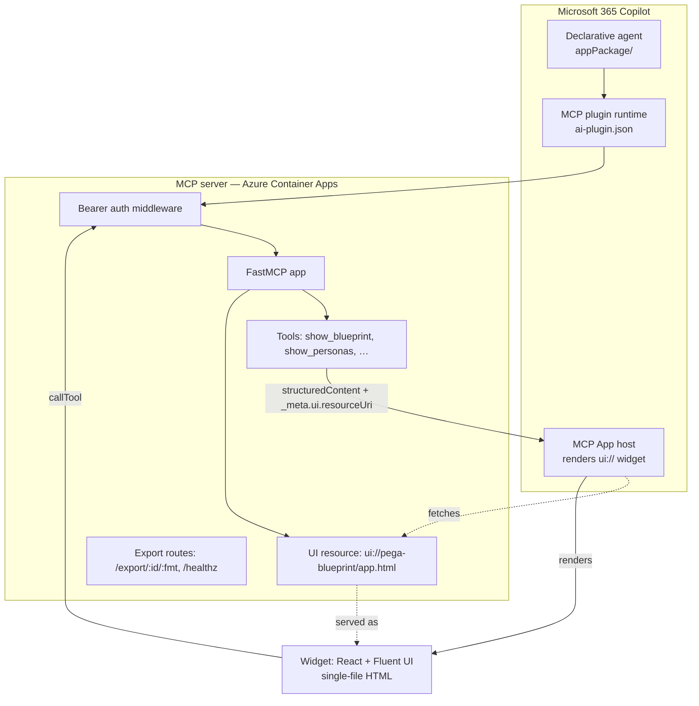
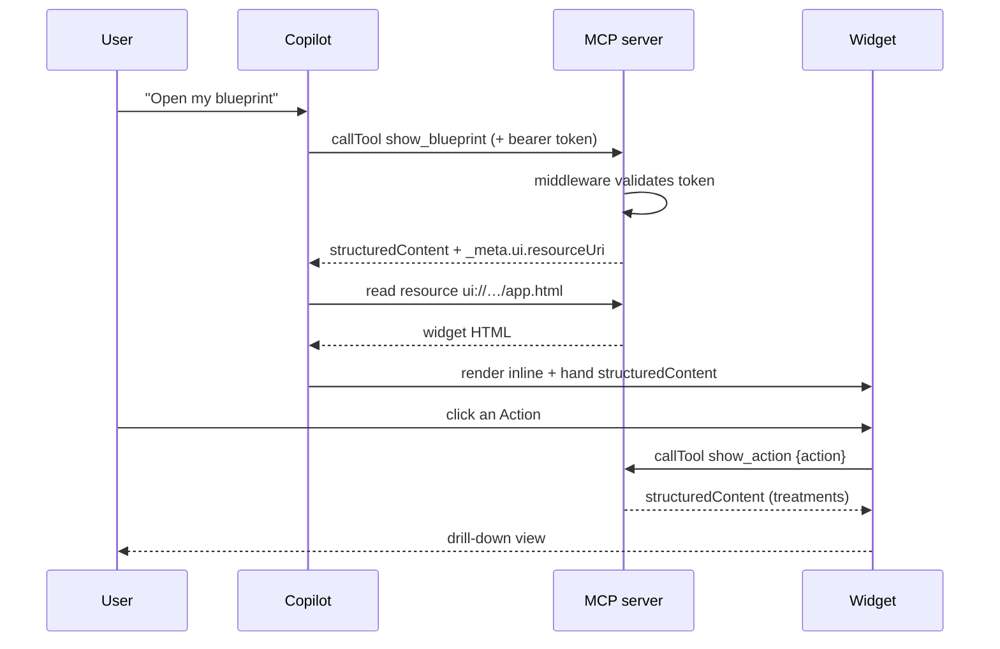

# Architecture

How the pieces fit, and the conventions that make an **MCP App** render rich UI
inline in Microsoft 365 Copilot.

## Components



- **Declarative agent** (`appPackage/manifest.json`, `declarativeAgent.json`) — the
  Copilot agent shell: name, instructions, conversation starters, and a pointer to
  the plugin.
- **MCP plugin manifest** (`appPackage/ai-plugin.json`) — a `RemoteMCPServer`
  runtime pointing at the server's `/mcp` URL, with the per-tool descriptions and
  the `auth` block.
- **MCP server** (`server/pega_mcp/`) — FastMCP app exposing tools + the widget
  resource, wrapped by an auth middleware, plus plain HTTP routes for health and
  file exports.
- **Widget** (`widgets/`) — a React/Fluent SPA built to a single HTML file and
  served as an MCP App resource.

## The MCP Apps rendering contract

Three things make Copilot render the widget instead of just printing data:

1. **The UI resource exists** — registered at a stable `ui://…` URI with MIME
   `text/html;profile=mcp-app`.
2. **Each UI tool links to it** — `_meta.ui.resourceUri` is set on **both**:
   - the **tool descriptor** (so the host knows the tool renders UI), and
   - **every tool result** (`CallToolResult._meta`) — this is what tells the host
     to render the widget *for this invocation*. Missing this is the #1 reason a
     tool "returns data but nothing renders".
3. **The widget is discoverable** — advertised via `listResourceTemplates`, which
   some hosts use to find renderable resources.

```python
# server/pega_mcp/tools.py  (shape)
def _result(text, structured, *, ui=True):
    kwargs = {"content": [TextContent(text=text)], "structuredContent": structured}
    if ui:
        kwargs["_meta"] = {"ui": {"resourceUri": WIDGET_URI}}   # ← on the RESULT
    return CallToolResult(**kwargs)
```

A data-only tool (`get_blueprint_summary`) omits the `_meta`, so it answers
factually without rendering a widget.

## Data flow



The widget routes on a `view` discriminator inside `structuredContent`, so a single
HTML bundle renders every phase (overview, personas, brand, experiences, action,
summary).

## Server internals

- **FastMCP** hosts the Streamable-HTTP MCP app. A module-level `app = build_app()`
  is the ASGI entry point (`uvicorn pega_mcp.server:app`).
- **`BearerAuthMiddleware`** is pure ASGI (not Starlette `BaseHTTPMiddleware`) so it
  never buffers the MCP streaming responses. It gates only `/mcp`; `/healthz` and
  `/export/...` stay public; `OPTIONS` passes through. On failure it returns a JSON
  `401` with `WWW-Authenticate: Bearer`.
- **Exports** are pure-Python: a minimal multi-page PDF writer, `openpyxl` for Excel,
  and an importable JSON artifact. No compiled dependencies.

## Why these choices

| Choice | Reason |
|---|---|
| **Pure-Python deps** | Slim/Oryx container builds with compiled wheels (pillow, cryptography) are slow and break; hand-rolled PDF + JWT verification avoid them. |
| **Single-file widget** | One `ui://` resource to serve; no asset hosting or CSP juggling. |
| **Container Apps, `min-replicas=1`** | No scale-to-zero cold starts — Copilot's MCP calls time out during a cold start. |
| **Pure-ASGI auth middleware** | Keeps MCP's streaming (SSE) responses intact. |
| **`view` discriminator** | One widget bundle handles all phases; tools just pick a view. |

See [security-and-login.md](security-and-login.md) for the auth design.
