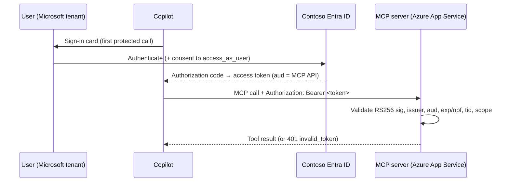

# Pega Blueprint MCP — Authentication Runbook

How the Microsoft 365 Copilot agent signs the user in to **Contoso Entra ID** and
calls the MCP server with a bearer token, and the exact steps to turn it on.

> **Demo note.** For this POC the "Contoso" tenant is `<TENANT_ID>`
> (where the Azure resources and the Entra app live). A real cross-tenant setup
> only changes the tenant id / authority URLs below — everything else is identical.

---

## 1. How it works



- **Auth type:** OAuth 2.0 authorization-code flow, brokered by the Teams/Copilot
  platform via an **OAuth client registration** in Teams Developer Portal. The
  `ai-plugin.json` runtime references it with `auth.type = OAuthPluginVault`.
- **Token validation** is done in-process by [pega_mcp/auth.py](../server/pega_mcp/auth.py)
  — a zero-compiled-dependency RS256/JWKS validator (so it survives the App
  Service Oryx build). [pega_mcp/server.py](../server/pega_mcp/server.py)'s
  `BearerAuthMiddleware` gates only the `/mcp` route; `/healthz` and
  `/export/...` stay public.

### Is it single sign-on?

Not silently, cross-tenant. The user lives in the Microsoft tenant; the API and
consent live in the Contoso tenant. The **first** protected call shows a sign-in
card (and a one-time consent). After that the platform caches/refreshes the token,
so it *feels* like SSO. True silent SSO is only possible when the user and the API
are in the **same** tenant — not the case for a cross-org "Contoso" scenario.

---

## 2. Current status

| Piece | State |
| --- | --- |
| Entra app registration (API app, scope, secret, redirect, SP) | ✅ done |
| MCP server auth code (`auth.py`, middleware, settings) | ✅ deployed (live) |
| `PEGA_MCP_ENTRA_*` app settings on Azure | ✅ set (auth still OFF) |
| Teams Dev Portal OAuth client registration | ✅ done (id below) |
| `ai-plugin.json` auth block | ✅ `OAuthPluginVault` (package rebuilt) |
| Server auth enforcement | ⏸️ **OFF** — `PEGA_MCP_REQUIRE_AUTH=false` |
| Re-upload OAuth package + flip enforcement on | ⬜ final cutover |

The server is **deployed with auth code present but disabled**, so the demo keeps
working anonymously. Turning auth on is the sequence below.

> **Final cutover (only two actions left):**
> 1. Re-upload `appPackage/build/PegaBlueprintMCP.zip` (now `OAuthPluginVault`) in
>    Copilot, replacing the anonymous version. With `REQUIRE_AUTH=false` this lets
>    you confirm the **sign-in card** appears and a token is issued, risk-free.
> 2. Once sign-in works, flip `PEGA_MCP_REQUIRE_AUTH=true` + restart (Step 4) so
>    the server enforces the token.

---

## 3. Reference values

| Name | Value |
| --- | --- |
| Contoso tenant id | `<TENANT_ID>` |
| API app (client) id | `<API_APP_ID>` |
| App ID URI | `api://<API_APP_ID>` |
| Scope (full) | `api://<API_APP_ID>/access_as_user` |
| Client secret | in `env/.contoso-oauth.secret` (gitignored) |
| Authorize URL | `https://login.microsoftonline.com/<TENANT_ID>/oauth2/v2.0/authorize` |
| Token URL | `https://login.microsoftonline.com/<TENANT_ID>/oauth2/v2.0/token` |
| Refresh URL | same as Token URL |
| Redirect URI (already on the app) | `https://teams.microsoft.com/api/platform/v1.0/oAuthRedirect` |
| OAuth client registration id (`reference_id`) | `<OAUTH_REGISTRATION_ID>` — a base64 value the Teams Developer Portal emits when you create the OAuth client (it encodes `<tenant-id>##<registration-guid>`) |
| App Service | `<APP_SERVICE_NAME>` (RG `rg-pega-blueprint-poc`) |
| MCP endpoint | `https://<APP_SERVICE_NAME>.azurewebsites.net/mcp` |

Read the secret value with:

```bash
python3 -c "import json;print(json.load(open('env/.contoso-oauth.secret'))['password'])"
```

---

## 4. Turn auth ON

### Step 0 — Re-authenticate Azure CLI (MFA)

The Azure **management plane** now requires MFA (Conditional Access), so
`az webapp ...` commands fail with `AADSTS50076` until you re-auth. Run this
**yourself in the terminal** (it opens a browser for MFA — do not share codes):

```bash
az login --tenant "<TENANT_ID>" \
  --scope "https://management.core.windows.net//.default"
```

> Graph commands (`az ad ...`) keep working without this because they use a
> different audience — that's why the Entra app could be created already.

### Step 1 — Set the server's Entra config (auth still OFF)

Set the validation settings first, keeping enforcement off so nothing breaks:

```bash
az webapp config appsettings set -g rg-pega-blueprint-poc -n <APP_SERVICE_NAME> --settings \
  PEGA_MCP_REQUIRE_AUTH=false \
  PEGA_MCP_ENTRA_TENANT_ID=<TENANT_ID> \
  PEGA_MCP_ENTRA_AUDIENCES="<API_APP_ID>,api://<API_APP_ID>" \
  PEGA_MCP_ENTRA_REQUIRED_SCOPE=access_as_user
```

### Step 2 — Register the OAuth client in Teams Developer Portal

This is a **portal-only** step (no CLI/Graph API). At
<https://dev.teams.microsoft.com> → **Tools → OAuth client registration → +
New OAuth client registration**:

| Field | Value |
| --- | --- |
| Registration name | `Pega Blueprint MCP (Contoso)` |
| Base URL | `https://<APP_SERVICE_NAME>.azurewebsites.net` |
| Restrict usage by org | your tenant (or leave default) |
| Restrict usage by app | the Pega Blueprint agent (`0a4b0bae-7565-4be5-a8d3-f5d89a0deb42`) |
| Client ID | `<API_APP_ID>` |
| Client secret | value from `env/.contoso-oauth.secret` |
| Authorization endpoint | the **Authorize URL** above |
| Token endpoint | the **Token URL** above |
| Refresh endpoint | the **Token URL** above |
| Scopes | `api://<API_APP_ID>/access_as_user` |
| Enable PKCE | ✅ on |

Save → copy the generated **Registration ID** (a GUID).

### Step 3 — Point the agent at the registration and rebuild

```bash
cd .
# Put the GUID from step 2 into the env file:
#   OAUTH_REGISTRATION_ID=<registration-id>
sed -i 's/^OAUTH_REGISTRATION_ID=.*/OAUTH_REGISTRATION_ID=<registration-id>/' env/.env.dev

# Rebuild the sideload package (auth block becomes OAuthPluginVault automatically):
./scripts/build_package.sh
```

This produces `appPackage/build/PegaBlueprintMCP.zip` with
`auth.type = OAuthPluginVault` and `reference_id = <registration-id>`. Re-upload
it in Copilot (**Agents → Manage → Upload** / Teams **Apps → Manage your apps →
Upload a custom app**), replacing the previous version.

> Using the Agents Toolkit instead? `OAUTH_REGISTRATION_ID` in `env/.env.dev` is
> substituted by `teamsApp/zipAppPackage` during `atk provision`. You can also
> bake the id directly by regenerating: from `server`,
> `OAUTH_REGISTRATION_ID=<id> uv run python scripts/gen_ai_plugin.py`.

### Step 4 — Flip enforcement on

```bash
az webapp config appsettings set -g rg-pega-blueprint-poc -n <APP_SERVICE_NAME> \
  --settings PEGA_MCP_REQUIRE_AUTH=true
az webapp restart -g rg-pega-blueprint-poc -n <APP_SERVICE_NAME>
```

---

## 5. Verify

```bash
BASE=https://<APP_SERVICE_NAME>.azurewebsites.net
# Public routes still 200:
curl -s -o /dev/null -w "healthz %{http_code}\n" "$BASE/healthz"
curl -s -o /dev/null -w "export  %{http_code}\n" "$BASE/export/CDHBP-335041/pdf"
# /mcp without a token must now be 401:
curl -s -o /dev/null -w "mcp(noauth) %{http_code}\n" -X POST \
  -H 'Content-Type: application/json' -H 'Accept: application/json, text/event-stream' \
  -d '{"jsonrpc":"2.0","id":1,"method":"ping"}' "$BASE/mcp"
```

Expected: `healthz 200`, `export 200`, `mcp(noauth) 401`. In Copilot, the first
"show my blueprint" prompt should pop a **sign-in** card; after signing in to
Contoso the widget renders as before.

A `401` body looks like: `{"error":"unauthorized","detail":"..."}` with a
`WWW-Authenticate: Bearer error="invalid_token"` header.

---

## 6. Rollback (back to anonymous)

```bash
az webapp config appsettings set -g rg-pega-blueprint-poc -n <APP_SERVICE_NAME> \
  --settings PEGA_MCP_REQUIRE_AUTH=false
az webapp restart -g rg-pega-blueprint-poc -n <APP_SERVICE_NAME>
# and rebuild/re-upload the package with OAUTH_REGISTRATION_ID empty for a clean anonymous client:
( cd . && sed -i 's/^OAUTH_REGISTRATION_ID=.*/OAUTH_REGISTRATION_ID=/' env/.env.dev && ./scripts/build_package.sh )
```

---

## 7. Troubleshooting

| Symptom | Likely cause / fix |
| --- | --- |
| `AADSTS50076` on `az webapp ...` | Management-plane MFA expired → rerun Step 0 (or `./scripts/az_login_mfa.sh`). |
| Sign-in card never appears | `ai-plugin.json` still `auth.type = None` → set `OAUTH_REGISTRATION_ID`, rebuild, re-upload. |
| **Blank window after sign-in** | First-time **consent stall** — common when the user is a *guest* in the resource tenant (guests can't self-consent). Pre-grant tenant-wide admin consent (`AllPrincipals`) for `access_as_user` + `openid profile offline_access`, and add `oAuthConsentRedirect` to the app's Web redirect URIs. Then retry. |
| 401 `invalid issuer` / `wrong audience` | `PEGA_MCP_ENTRA_*` settings don't match the token; confirm tenant id + both audience forms. |
| 401 `missing scope` | OAuth registration scope isn't `.../access_as_user`, or admin/user consent not granted. |
| 401 after token expiry only | expected; platform refreshes via the Refresh URL. Confirm refresh endpoint is set. |
| 500 instead of 401 | server bug — check App Service log stream; the validator should only ever 401. |
