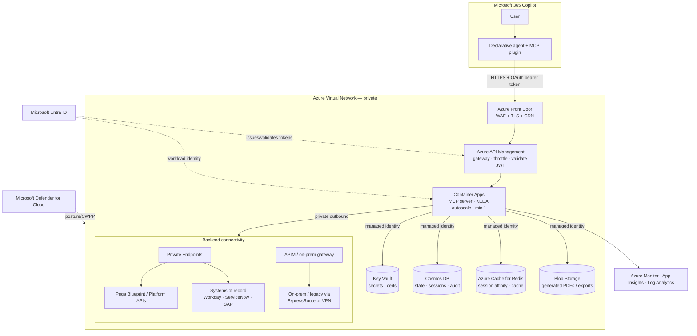

# Production architecture

This document describes how to take the POC in this repo — a single Azure
Container App running the MCP server with a built-in demo dataset — to a
**hardened, enterprise-grade deployment on Azure** that securely connects to
**real backend systems** (Pega Blueprint / Platform, systems of record) and
**persists state** (blueprints, sessions, audit) in a managed database.

The guidance maps every concern to a **Microsoft / Azure** product so the
solution stays governed, scalable, and observable.

> The POC keeps things deliberately simple: in-memory demo data, optional auth,
> one replica. None of that is wrong for a demo — this doc is the "what changes
> when it's real" checklist.

---

## 1. Reference architecture

The MCP server stays the **center of the system** (it serves data *and* the
widget), but in production it is fronted by a gateway, runs inside a private
network, holds no secrets itself, and talks to backends and a database over
private connectivity.

---

## 2. Component mapping (POC → production)

| Concern | POC (this repo) | Production on Azure |
| --- | --- | --- |
| Compute | 1× Azure Container App, `min-replicas=1` | Container Apps with **KEDA** autoscale (HTTP + queue rules), multi-replica, zone-redundant |
| Ingress / edge | ACA public ingress | **Azure Front Door** (WAF, TLS, global anycast, caching) → **API Management** |
| API gateway | none | **Azure API Management** — JWT validation, rate-limit, quotas, request/response policy, product keys |
| Identity | optional bearer (3 modes) | **Microsoft Entra ID** end-to-end; **managed identities** for all Azure-to-Azure calls (no secrets) |
| Secrets | env vars / Key Vault optional | **Azure Key Vault** (referenced by managed identity; no secrets in config) |
| **State / data** | in-memory dict | **Azure Cosmos DB** (blueprints, sessions, audit) + **Redis** (cache) + **Blob** (exports) |
| **Backend integration** | seeded demo data | **Private Endpoints** to Pega & SoR APIs; **APIM** or **on-prem data gateway** for legacy; **ExpressRoute/VPN** for on-prem |
| Networking | public | **VNet-integrated** Container Apps, **Private Endpoints**, **Private DNS**, NSGs, no public data plane |
| Observability | container logs | **Application Insights** (OpenTelemetry traces), **Log Analytics**, **Azure Monitor** alerts, dashboards |
| Security posture | — | **Microsoft Defender for Cloud** (CSPM + container/CWPP), **Microsoft Sentinel** (SIEM) |
| CI/CD | manual `deploy_azure.sh` | **GitHub Actions / Azure DevOps** → ACR build → staging slot → canary → prod, IaC via **Bicep** |
| Config / flags | env vars | **Azure App Configuration** (typed settings + feature flags) |

---

## 3. Backend system connectivity (the integration tier)

In production the MCP tools stop returning seeded data and instead **call real
backends** — Pega Blueprint/Platform APIs to read or generate blueprints, and
**systems of record** (Workday, ServiceNow, SAP, mainframe, etc.) for the data
objects and integrations a blueprint references. This is the most security-
sensitive part of the system, because the MCP server becomes a **confused-deputy
risk**: it acts on behalf of a user against privileged backends.

**Connectivity**

- **Private Endpoints + Private DNS** for any backend exposed on Azure or via
  Azure Private Link. The MCP server's egress never traverses the public
  internet for these calls.
- **Azure API Management (outbound)** or a dedicated egress gateway in front of
  third-party/SaaS APIs (Pega Cloud, Workday, ServiceNow) so you get one place
  for retries, circuit-breaking, caching, request signing, and per-backend
  throttling.
- **ExpressRoute or Site-to-Site VPN** for on-prem / legacy systems; for
  document/desktop-style sources use the **on-premises data gateway**.
- **NSGs + UDRs + Azure Firewall** to constrain egress to an explicit allow-list
  of backend FQDNs/IPs (deny-by-default egress).

**Identity & authorization to backends (don't store passwords)**

- Prefer the **OAuth 2.0 On-Behalf-Of (OBO)** flow: the user's Copilot token is
  exchanged (via Entra ID) for a downstream token scoped to the specific backend,
  so the backend sees the **real user** and enforces *its own* authorization.
  This preserves least privilege end-to-end and gives per-user audit at the SoR.
- For system-to-system calls with no user context, use a **managed identity** or
  a **workload-identity federation** to the backend's IdP — never a static
  client secret. If a secret is unavoidable (legacy basic-auth), keep it in
  **Key Vault** and rotate it.
- Scope tokens narrowly (one audience/scope per backend). Cache them in Redis
  with their natural TTL; never log them.

**Resilience around backends**

- Treat every backend call as fallible: timeouts, retries with jitter, and a
  **circuit breaker** (Polly-style) so a slow SoR can't exhaust MCP replicas.
- Use **idempotency keys** for any write/generate operation.
- Offload long-running backend work (e.g. "generate blueprint") to an
  **async pattern**: enqueue to **Azure Service Bus / Storage Queue**, return a
  job id, and let a **KEDA**-scaled worker process it — the widget polls or is
  notified. This keeps the synchronous MCP path fast (Copilot has tool timeouts).

**Data minimization**

- Pull only the fields the widget needs; don't mirror entire SoR records.
- Classify and tag any sensitive fields; apply **Microsoft Purview** for data
  governance/lineage if regulated data flows through.

---

## 4. State & data with Cosmos DB

The POC holds blueprints in a process-local dict — fine for one replica, but it
**won't survive a restart or scale-out**. Production needs durable, shared state.
**Azure Cosmos DB** (NoSQL API) is the right primary store: low-latency, elastic,
multi-region, serverless or autoscale, with a clean JSON document model that maps
directly to the blueprint payloads this server already produces.

**Why Cosmos DB here**

- The blueprint *is* a JSON document (`id`, `caseTypes[]`, `personas[]`,
  `dataObjects[]`, …) — a natural fit for a document database; no ORM impedance.
- Per-partition scale and single-digit-ms reads keep the synchronous MCP tool
  calls within Copilot's latency budget.
- **Autoscale RU/s** (or **serverless** for spiky demo/dev) tracks load and cost.
- **Multi-region writes + 99.999% SLA** when you need global/HA.
- Native **TTL** for ephemeral data (sessions, idempotency keys, draft state).

**Suggested containers (collections)**

| Container | Partition key | Holds | Notes |
| --- | --- | --- | --- |
| `blueprints` | `/tenantId` (or `/ownerId`) | the blueprint documents | the durable replacement for the in-memory `_store` |
| `sessions` | `/sessionId` | per-conversation working state, "current blueprint" pointer | **TTL** to expire; replaces the module-level `_current_id` |
| `audit` | `/tenantId` | who created/edited/exported what, and which tool ran | append-only; feeds Sentinel/compliance |
| `idempotency` | `/key` | dedupe keys for generate/write ops | short **TTL** |

**Access pattern (maps onto today's code)**

- `server/pega_mcp/store.py` becomes a thin repository over Cosmos: `get()`,
  `create_blueprint()`, `view_*()` read/write documents instead of a dict.
  The view/tool layer above it is unchanged — a clean seam already exists.
- Connect with the **Cosmos DB SDK using a managed identity** (Entra RBAC data
  plane: `Cosmos DB Built-in Data Contributor`) — **no connection strings/keys**.
- Partition by tenant for multi-tenant isolation; enforce tenant scoping in
  every query (defense against cross-tenant reads).

**Complementary stores**

- **Azure Cache for Redis** — hot blueprint cache, backend-token cache, and
  optional session affinity; takes read pressure off Cosmos.
- **Azure Blob Storage** — the generated **PDF/Excel/Blueprint exports** (the POC
  builds these in-process; in prod write them to Blob and hand out short-lived
  **SAS** or Front Door signed URLs instead of streaming through the server).
- **Azure Service Bus / Storage Queue** — async job queue for long backend calls.

> Relational alternative: if you need strong cross-entity transactions or heavy
> reporting joins, **Azure SQL / PostgreSQL Flexible Server** is the swap-in.
> For this document-shaped, high-read workload, Cosmos DB is the better default.

---

## 5. Security

Defense in depth, mapped to Microsoft products:

**Identity**
- **Microsoft Entra ID** is the single identity authority. Copilot → MCP uses
  OAuth (see [security-and-login.md](security-and-login.md)); MCP → backends uses
  **OBO**; MCP → Azure resources uses **managed identity**. Goal: **zero static
  secrets** in the running system.
- **Conditional Access** (MFA, device compliance, risk) governs who can reach the
  agent; **PIM** for just-in-time admin access to the subscription.

**Network**
- Container Apps **VNet integration**; data plane reachable only via **Front Door
  → APIM**. **Private Endpoints** for Cosmos, Key Vault, Storage, Redis, and
  backends. **Private DNS zones**. **Deny-by-default egress** via Azure Firewall.

**Edge**
- **Azure Front Door WAF** (or **Application Gateway WAF**) with OWASP rules,
  bot protection, and rate-limiting in front of everything public.
- **APIM** validates the JWT (issuer, audience, scope, expiry) *before* the
  request reaches the MCP server — the server's own check becomes belt-and-suspenders.

**Secrets & keys**
- **Azure Key Vault** (RBAC, soft-delete, purge protection) for any unavoidable
  secret/cert; referenced via managed identity. Rotation automated.

**Data protection**
- Encryption in transit (TLS 1.2+) and at rest (platform-managed or
  **customer-managed keys** in Key Vault). Tenant isolation enforced in every
  Cosmos query. **Microsoft Purview** for classification/DLP on regulated data.

**Posture & detection**
- **Microsoft Defender for Cloud** — CSPM + Defender for Containers (image scan,
  runtime threat detection). **Microsoft Sentinel** — SIEM/SOAR over the audit
  container, APIM, Entra, and platform logs. Pin image digests; scan in CI
  (**Microsoft Defender for DevOps** / Trivy).

**Prompt-injection & tool-abuse hardening** (agent-specific)
- Treat backend/tool outputs as untrusted; never let them silently escalate
  privilege. Enforce per-tool authorization server-side (don't rely on the model
  to be well-behaved). Log every tool invocation to `audit` with the calling
  identity. Apply allow-lists for any tool that triggers a backend write.

---

## 6. Scalability & performance

- **KEDA autoscaling** on Container Apps: scale on concurrent HTTP requests and
  on queue depth for the async workers. Keep **`min-replicas ≥ 1`** (warm) — the
  one POC setting worth preserving, because Copilot times out on cold starts.
- **Stateless replicas**: with state in Cosmos/Redis, any replica serves any
  request; scale horizontally without affinity. Use Redis only for optional
  caching, not as the source of truth.
- **Cosmos autoscale RU/s** + good partition keys to avoid hot partitions;
  cache hot reads in Redis.
- **Front Door caching** for the widget HTML and static assets; the widget is a
  single immutable file per release — cache it at the edge.
- **Async offload** of long backend operations so synchronous tool calls stay
  well under Copilot's timeout.
- **Zone redundancy** for the Container Apps environment and Cosmos; **multi-
  region** (Front Door + Cosmos multi-region) for global or DR-critical use.

---

## 7. Observability

- **Application Insights** with **OpenTelemetry** from the FastMCP/uvicorn app:
  distributed traces that stitch *Copilot → APIM → MCP → backend → Cosmos*, so
  you can see exactly where a slow tool call spends its time.
- **Log Analytics** as the sink; **Azure Monitor** alerts on latency, 5xx, auth
  failures, RU throttling (429s from Cosmos), and backend circuit-breaker trips.
- **Dashboards/Workbooks** for tool-call volume, p95 latency per tool, blueprint
  create rate, and backend error rates.
- Correlate a Copilot request id through every hop; emit structured audit events
  to the `audit` container and Sentinel.

---

## 8. Resilience & DR

- **Multi-zone** by default; **multi-region** for critical workloads (Front Door
  routes, Cosmos multi-region writes, geo-redundant Blob).
- Define **RPO/RTO**; Cosmos continuous backup (point-in-time restore) and Key
  Vault soft-delete/purge-protection support them.
- **Health probes** (`/healthz` already exists) drive Container Apps restarts and
  Front Door origin health.
- **Graceful backend degradation**: when a SoR is down, serve cached/last-known
  data and surface a clear "live data unavailable" state rather than failing the
  whole tool call.

---

## 9. CI/CD & IaC

- **Infrastructure as Code with Bicep** (or Terraform): VNet, Container Apps env,
  Cosmos, Key Vault, APIM, Front Door, Private Endpoints, RBAC — all reproducible.
- **GitHub Actions / Azure DevOps** pipeline:
  1. build + type-check the widget, run the server smoke test;
  2. build the image in **ACR** (pinned base, vulnerability scan);
  3. deploy to a **staging** Container Apps revision;
  4. **canary / traffic-split** to a percentage of traffic, watch App Insights;
  5. promote to 100%; auto-rollback on alert.
- Keep the demo's `scripts/deploy_azure.sh` as the **dev/quickstart** path; the
  pipeline is the governed prod path.
- Regenerate and re-publish the Copilot app package (`./scripts/build_package.sh`)
  as part of release when tools or the endpoint change.

---

## 10. Cost notes

- **Container Apps**: pay for the warm `min-replicas` + per-request scale. One
  small always-on replica is inexpensive and removes cold starts.
- **Cosmos DB**: **serverless** for dev/low traffic; **autoscale RU/s** for prod.
  TTL keeps `sessions`/`idempotency` small.
- **Front Door / APIM / Defender / Sentinel** are the main fixed costs — adopt
  them when the workload is genuinely production/regulated, not for a demo.
- Right-size with **Azure Advisor** + cost alerts; scale non-prod to zero where
  cold starts are acceptable (i.e. *not* the Copilot-facing prod app).

---

## 11. What to change in this repo to get there

1. **State**: replace the in-memory `_store`/`_current_id` in
   [server/pega_mcp/store.py](../server/pega_mcp/store.py) with a Cosmos DB
   repository (managed-identity auth). Keep the `view_*` seam intact.
2. **Backends**: replace the seeded data in
   [server/pega_mcp/data.py](../server/pega_mcp/data.py) with backend clients
   (Pega/SoR) behind the same interface; add OBO token exchange + Polly-style
   resilience; move long calls to an async worker.
3. **Exports**: write PDFs/Excel to **Blob** and return signed URLs instead of
   streaming from the server.
4. **Auth**: turn on auth (`PEGA_MCP_REQUIRE_AUTH=true`) and front it with APIM
   JWT validation; use managed identity for all Azure calls.
5. **Network**: VNet-integrate the Container App; add Private Endpoints + Front
   Door + WAF.
6. **Pipeline**: codify everything in Bicep + a CI/CD pipeline; add App
   Insights/OpenTelemetry and Defender/Sentinel.

See [architecture.md](architecture.md) for the MCP-Apps rendering contract and
[security-and-login.md](security-and-login.md) for the Copilot↔MCP auth design.
