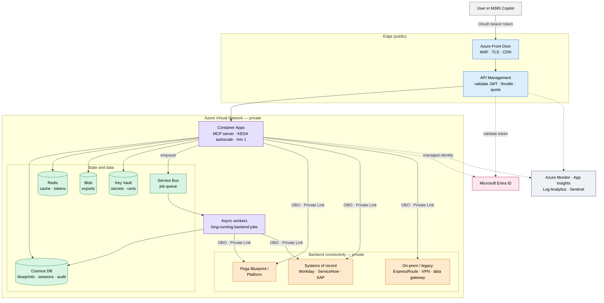
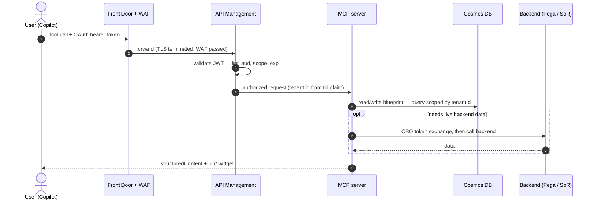
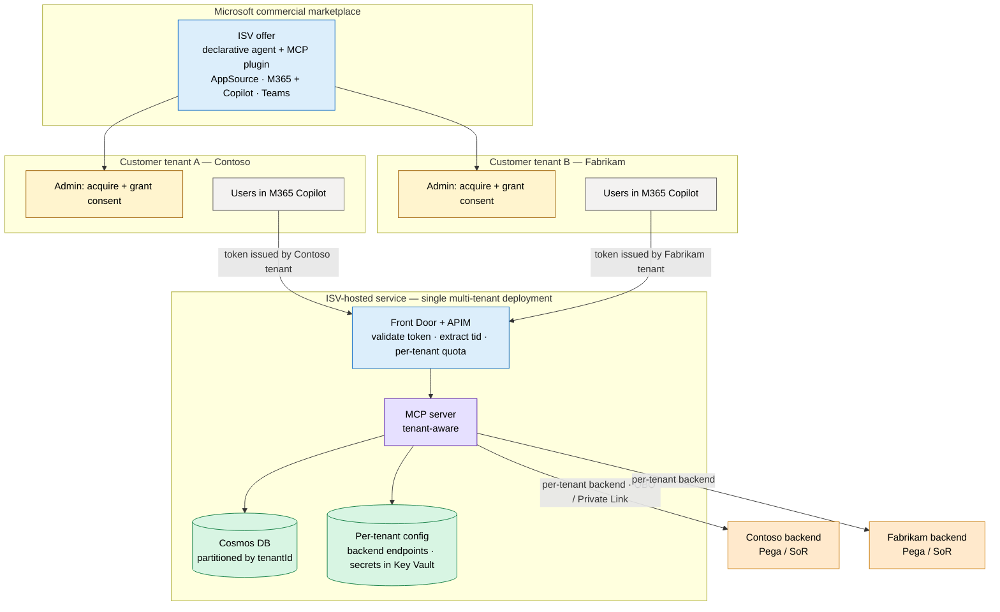
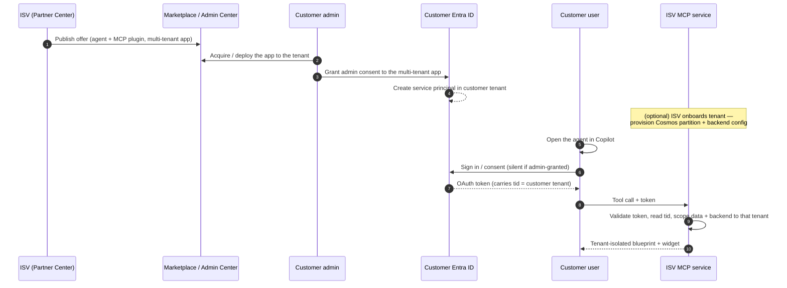
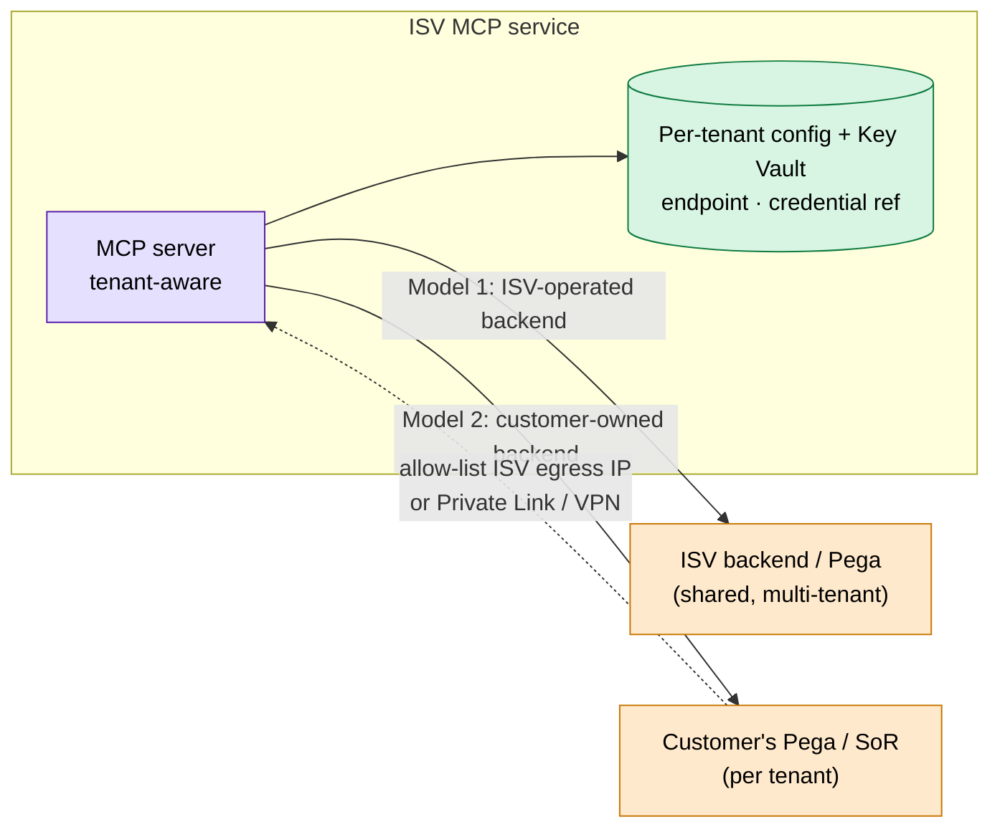

# Production architecture

This document describes how to take the POC in this repo — a single Azure
Container App running the MCP server with a built-in demo dataset — to a
**hardened, enterprise-grade deployment on Azure** that:

- securely connects to **real backend systems** (Pega Blueprint / Platform,
  systems of record),
- **persists state** (blueprints, sessions, audit) in a managed database, and
- is distributed as an **ISV product to many customer tenants** via the
  Microsoft commercial marketplace.

Every concern maps to a **Microsoft / Azure** product so the solution stays
governed, scalable, and observable.

> The POC keeps things deliberately simple: in-memory demo data, optional auth,
> one replica, one tenant. None of that is wrong for a demo — this doc is the
> "what changes when it's real (and multi-tenant)" checklist.

**Contents**

1. [Reference architecture](#1-reference-architecture)
2. [ISV distribution and multi-tenant model](#2-isv-distribution-and-multi-tenant-model)
3. [Component mapping (POC → production)](#3-component-mapping-poc--production)
4. [Backend system connectivity](#4-backend-system-connectivity)
5. [State and data with Cosmos DB](#5-state-and-data-with-cosmos-db)
6. [Security](#6-security)
7. [Scalability and performance](#7-scalability-and-performance)
8. [Observability](#8-observability)
9. [Resilience and DR](#9-resilience-and-dr)
10. [CI/CD and IaC](#10-cicd-and-iac)
11. [Cost notes](#11-cost-notes)
12. [What to change in this repo](#12-what-to-change-in-this-repo)

---

## 1. Reference architecture

The MCP server stays the **center of the system** (it serves data *and* the
widget), but in production it is fronted by a gateway, runs inside a private
network, holds no secrets itself, and reaches backends and a database over
private connectivity.

**Request lifecycle** — one tool call from Copilot through the production stack:

---

## 2. ISV distribution and multi-tenant model

The intended go-to-market is **ISV SaaS**: you (the ISV) host **one** MCP service,
publish the agent through the Microsoft commercial marketplace, and **many
customer tenants install it**. Each customer's users run the agent inside *their
own* Microsoft 365 Copilot and connect to **your** MCP server. The server is
therefore **multi-tenant** and must isolate every tenant's data and backend
access.

### 2.1 Topology

Key point: there is **one app registration** (a *multi-tenant* Entra app,
`signInAudience = AzureADMultipleOrgs`) and **one MCP deployment**. Customer
tenants don't get their own copy of your infrastructure — they get a **service
principal** in *their* tenant when they consent, and their users' tokens carry
their own `tid` (tenant id) claim, which your service uses to isolate everything.
This is the same **"entra-as-generic"** pattern the POC already uses
([security-and-login.md](security-and-login.md)) — Microsoft identity with no
per-tenant provisioning on the identity side.

### 2.2 Distribution and onboarding

**Publishing** (Microsoft commercial marketplace via **Partner Center**):

- Package the declarative agent + MCP plugin (`appPackage/`) and publish it as a
  **Microsoft 365 / Copilot** app offer (AppSource), optionally also listed in the
  **Teams** store. The same package can be sideloaded for pilots before listing.
- The package embeds your MCP endpoint and the **OAuth client `reference_id`**
  (Teams Developer Portal). It contains **no per-customer values** — every
  customer installs the identical package.
- Choose a transactability model: free / bring-your-own-license, or a
  **transactable SaaS offer** with Microsoft handling billing (see §2.6).
- Expect **Microsoft 365 app certification / Publisher Verification** for store
  listing; budget for the security review.

**Customer install**: a tenant admin acquires the app, grants **admin consent**
to the multi-tenant Entra app once (so all users get silent SSO), and assigns it
to users (or enables self-install). Conditional Access in the *customer's* tenant
then governs who can use it.

### 2.3 Tenant isolation models

Pick an isolation strategy per resource. Most ISVs start **pooled** and offer a
**silo** tier for premium/regulated customers (the "bridge" model).

| Model | Compute | Data (Cosmos) | Pros | Use when |
| --- | --- | --- | --- | --- |
| **Pool** (shared) | one MCP deployment for all tenants | one account, **partition key = `tenantId`** | cheapest, simplest ops, elastic | most tenants; SMB/standard tier |
| **Silo** (dedicated) | tenant-dedicated app/env | tenant-dedicated DB or account | strong blast-radius + residency isolation | regulated / large / data-residency tenants |
| **Bridge** (hybrid) | shared compute, **dedicated data** for some | per-tenant DB for premium, pooled for the rest | balance cost vs isolation | mixed customer base |

**Non-negotiable for the pooled model**: every Cosmos query is **scoped by the
`tenantId`** derived from the validated token's `tid` claim — never from anything
the client sends. Treat a missing/mismatched `tid` as a hard auth failure. This
is the primary guard against cross-tenant data leaks.

### 2.4 Per-tenant backend connectivity (the hard part)

Your users connect to the MCP server at the ISV — but **whose backend** does the
MCP server then call? Two patterns, often combined:

- **Model 1 — ISV-operated backend.** The ISV runs the backend centrally (e.g.
  your own Pega instance / aggregation layer). Simplest connectivity, but
  tenant data flows through ISV-controlled systems — be explicit about that in
  your data-handling terms.
- **Model 2 — customer-owned backend (BYO-backend).** Each tenant points at
  *their own* Pega / system of record. The MCP server keeps **per-tenant
  connection config** keyed by `tenantId` — endpoint + a **credential reference**
  to a Key Vault secret (or, better, a federated identity). Connectivity options:
  - the customer **allow-lists your stable egress** (NAT Gateway IP / Front Door)
    and you call their public-but-restricted API;
  - or **per-tenant private connectivity** (Private Link service, or
    Site-to-Site VPN) for customers that won't expose a public endpoint.
  - For identity, prefer **OBO** so the user's identity flows to the customer's
    backend (it enforces its own authz); fall back to a **per-tenant app
    credential** when no federation exists.
- **Onboarding a tenant's backend** becomes a first-class step: capture the
  endpoint + credentials at install/admin-config time, store the secret in Key
  Vault (reference it by `tenantId`), and validate connectivity before enabling
  live tools. Until then, the tenant can run against demo/sample data.

### 2.5 Identity and consent specifics

- **Multi-tenant Entra app** (`AzureADMultipleOrgs`) + the **`/common`** or
  `/organizations` authorize/token endpoints, with **user-consentable** Graph
  scopes (e.g. `User.Read`). This gives Microsoft SSO across all customer tenants
  with **no admin consent required by default** — though most customers will
  grant **admin consent** once for silent rollout.
- The token your server validates carries `tid` (tenant) and the user's `oid`
  (object id). Use `tid` for isolation and `oid` for per-user audit.
- **Guest/B2B users**: a guest's token carries the *resource* tenant's `tid`;
  decide whether guests are in scope and document it.
- Each customer's **Conditional Access** (MFA, device compliance, network) applies
  automatically — you inherit their controls without configuring anything.

### 2.6 Metering, billing, and tenant lifecycle

- **Billing**: a **transactable SaaS offer** in the marketplace lets Microsoft
  handle purchase, invoicing, and the customer's existing Azure/M365 agreement.
  For usage-based pricing, emit usage to the **Azure Marketplace Metering
  Service**; for seat-based, reconcile against assigned licenses.
- **Per-tenant usage** is tracked from the `audit` container (tool calls,
  blueprints created, exports) — feeds both billing and capacity planning.
- **Lifecycle**: **onboard** (create the tenant's Cosmos partition + backend
  config on first admin consent / subscription webhook), **suspend** (honor
  marketplace cancellation webhooks), and **offboard** (delete the tenant's
  partition + Key Vault secrets to meet data-deletion/GDPR obligations).
- **Data residency**: regulated customers may require their data in a specific
  region — satisfy with **region-pinned silos** or **Cosmos multi-region** with
  the tenant pinned to a region.

### 2.7 Noisy-neighbor and fairness

- **Per-tenant rate limits and quotas at APIM** (keyed on `tid`) so one tenant
  can't starve others.
- **Per-tenant Cosmos throughput** awareness — watch for hot partitions; a very
  large tenant may warrant a dedicated container/account (the silo tier).
- Tag telemetry with `tenantId` so dashboards and alerts are per-tenant.

---

## 3. Component mapping (POC → production)

| Concern | POC (this repo) | Production on Azure |
| --- | --- | --- |
| Compute | 1× Azure Container App, `min-replicas=1` | Container Apps with **KEDA** autoscale (HTTP + queue rules), multi-replica, zone-redundant |
| Tenancy | single tenant, demo data | **multi-tenant**: `tid`-scoped data + per-tenant config (see §2) |
| Ingress / edge | ACA public ingress | **Azure Front Door** (WAF, TLS, global anycast, caching) → **API Management** |
| API gateway | none | **Azure API Management** — JWT validation, **per-tenant** rate-limit/quota, request/response policy |
| Identity | optional bearer (3 modes) | **Microsoft Entra ID** multi-tenant app; **managed identities** for all Azure-to-Azure calls (no secrets) |
| Secrets | env vars / Key Vault optional | **Azure Key Vault** (referenced by managed identity; per-tenant backend creds) |
| **State / data** | in-memory dict | **Azure Cosmos DB** (blueprints, sessions, audit) + **Redis** (cache) + **Blob** (exports) |
| **Backend integration** | seeded demo data | **Private Endpoints** / per-tenant connectivity to Pega and SoR; **on-prem data gateway**; **ExpressRoute/VPN** |
| Networking | public | **VNet-integrated** Container Apps, **Private Endpoints**, **Private DNS**, NSGs, no public data plane |
| Observability | container logs | **Application Insights** (OpenTelemetry traces), **Log Analytics**, **Azure Monitor** alerts, per-tenant dashboards |
| Security posture | — | **Microsoft Defender for Cloud** (CSPM + container/CWPP), **Microsoft Sentinel** (SIEM) |
| CI/CD | manual `deploy_azure.sh` | **GitHub Actions / Azure DevOps** → ACR build → staging → canary → prod, IaC via **Bicep** |
| Distribution | manual sideload | **Microsoft commercial marketplace** (Partner Center), transactable SaaS offer |
| Config / flags | env vars | **Azure App Configuration** (typed settings + feature flags) |

---

## 4. Backend system connectivity

In production the MCP tools stop returning seeded data and instead **call real
backends** — Pega Blueprint/Platform APIs to read or generate blueprints, and
**systems of record** (Workday, ServiceNow, SAP, mainframe, etc.) for the data
objects and integrations a blueprint references. This is the most security-
sensitive part of the system, because the MCP server becomes a **confused-deputy
risk**: it acts on behalf of a user against privileged backends. In the ISV model
the backend is often **per-tenant** (§2.4).

**Connectivity**

- **Private Endpoints + Private DNS** for any backend exposed on Azure / Private
  Link. The MCP server's egress never traverses the public internet for these.
- **Azure API Management (outbound)** or a dedicated egress gateway in front of
  third-party / SaaS APIs (Pega Cloud, Workday, ServiceNow) so retries,
  circuit-breaking, caching, request signing, and per-backend throttling live in
  one place.
- **ExpressRoute or Site-to-Site VPN** for on-prem / legacy; for document /
  desktop-style sources use the **on-premises data gateway**.
- **NSGs + UDRs + Azure Firewall / NAT Gateway** to constrain egress to an
  explicit allow-list of backend FQDNs/IPs (deny-by-default egress) and present a
  **stable egress IP** customers can allow-list.

**Identity and authorization to backends (don't store passwords)**

- Prefer the **OAuth 2.0 On-Behalf-Of (OBO)** flow: exchange the user's Copilot
  token (via Entra ID) for a downstream token scoped to the specific backend, so
  the backend sees the **real user** and enforces *its own* authorization —
  least privilege end-to-end and per-user audit at the SoR.
- For system-to-system calls with no user context, use a **managed identity** or
  **workload-identity federation** to the backend's IdP — never a static client
  secret. If a secret is unavoidable (legacy basic-auth), keep it in **Key Vault**
  and rotate it. In multi-tenant mode, key the secret by `tenantId`.
- Scope tokens narrowly (one audience/scope per backend). Cache them in Redis
  with their natural TTL; never log them.

**Resilience around backends**

- Treat every backend call as fallible: timeouts, retries with jitter, and a
  **circuit breaker** (Polly-style) so a slow SoR can't exhaust MCP replicas.
- Use **idempotency keys** for any write/generate operation.
- Offload long-running backend work (e.g. "generate blueprint") to an **async
  pattern**: enqueue to **Azure Service Bus / Storage Queue**, return a job id,
  and let a **KEDA**-scaled worker process it — the widget polls or is notified.
  This keeps the synchronous MCP path fast (Copilot has tool timeouts).

**Data minimization**

- Pull only the fields the widget needs; don't mirror entire SoR records.
- Classify/tag sensitive fields; apply **Microsoft Purview** for governance /
  lineage if regulated data flows through.

---

## 5. State and data with Cosmos DB

The POC holds blueprints in a process-local dict — fine for one replica, but it
**won't survive a restart or scale-out**, and it can't isolate tenants.
Production needs durable, shared, **tenant-partitioned** state. **Azure Cosmos
DB** (NoSQL API) is the right primary store: low-latency, elastic, multi-region,
serverless or autoscale, with a clean JSON document model that maps directly to
the blueprint payloads this server already produces.

**Why Cosmos DB here**

- The blueprint *is* a JSON document (`id`, `caseTypes[]`, `personas[]`,
  `dataObjects[]`, …) — a natural fit; no ORM impedance.
- Per-partition scale + single-digit-ms reads keep synchronous MCP tool calls
  within Copilot's latency budget.
- **Autoscale RU/s** (or **serverless** for dev) tracks load and cost.
- **Multi-region writes + 99.999% SLA** for global / HA, and **per-tenant region
  pinning** for data residency.
- Native **TTL** for ephemeral data (sessions, idempotency keys, draft state).

**Suggested containers (collections)**

| Container | Partition key | Holds | Notes |
| --- | --- | --- | --- |
| `blueprints` | `/tenantId` | the blueprint documents | the durable, tenant-isolated replacement for `_store` |
| `sessions` | `/tenantId` (or `/sessionId`) | per-conversation working state, "current blueprint" pointer | **TTL** to expire; replaces `_current_id` |
| `tenantConfig` | `/tenantId` | per-tenant backend endpoints, feature flags, Key Vault secret refs | drives §2.4 connectivity |
| `audit` | `/tenantId` | who created/edited/exported what, and which tool ran | append-only; feeds Sentinel + billing |
| `idempotency` | `/key` | dedupe keys for generate/write ops | short **TTL** |

**Access pattern (maps onto today's code)**

- `server/pega_mcp/store.py` becomes a thin repository over Cosmos: `get()`,
  `create_blueprint()`, `view_*()` read/write documents instead of a dict. The
  view/tool layer above it is unchanged — a clean seam already exists.
- Connect with the **Cosmos DB SDK using a managed identity** (Entra RBAC data
  plane: `Cosmos DB Built-in Data Contributor`) — **no connection strings/keys**.
- **Always pass `tenantId` (from the validated `tid` claim) as the partition
  key** and include it in every query predicate — the core multi-tenant guard.

**Complementary stores**

- **Azure Cache for Redis** — hot blueprint cache, backend-token cache, optional
  session affinity; takes read pressure off Cosmos.
- **Azure Blob Storage** — the generated **PDF / Excel / Blueprint exports** (the
  POC builds these in-process; in prod write them to Blob and hand out short-lived
  **SAS** / signed URLs instead of streaming through the server).
- **Azure Service Bus / Storage Queue** — async job queue for long backend calls.

> Relational alternative: if you need strong cross-entity transactions or heavy
> reporting joins, **Azure SQL / PostgreSQL Flexible Server** is the swap-in. For
> this document-shaped, high-read, multi-tenant workload, Cosmos DB is the better
> default.

---

## 6. Security

Defense in depth, mapped to Microsoft products:

**Identity**
- **Microsoft Entra ID** is the single identity authority. Copilot → MCP uses
  OAuth (see [security-and-login.md](security-and-login.md)); MCP → backends uses
  **OBO**; MCP → Azure resources uses **managed identity**. Goal: **zero static
  secrets** in the running system.
- **Conditional Access** (the customer's) governs who reaches the agent; **PIM**
  for just-in-time admin access to the ISV subscription.

**Network**
- Container Apps **VNet integration**; data plane reachable only via **Front Door
  → APIM**. **Private Endpoints** for Cosmos, Key Vault, Storage, Redis, and
  backends. **Private DNS zones**. **Deny-by-default egress** via Azure Firewall.

**Edge**
- **Azure Front Door WAF** (or **Application Gateway WAF**) with OWASP rules, bot
  protection, and rate-limiting in front of everything public.
- **APIM** validates the JWT (issuer, audience, scope, expiry) **and the `tid`**
  *before* the request reaches the MCP server — the server's own check becomes
  belt-and-suspenders.

**Secrets and keys**
- **Azure Key Vault** (RBAC, soft-delete, purge protection) for any unavoidable
  secret/cert, referenced via managed identity. Per-tenant backend creds are
  keyed by `tenantId`. Rotation automated.

**Data protection**
- Encryption in transit (TLS 1.2+) and at rest (platform-managed or
  **customer-managed keys** in Key Vault). **Tenant isolation enforced in every
  Cosmos query.** **Microsoft Purview** for classification / DLP on regulated data.

**Posture and detection**
- **Microsoft Defender for Cloud** — CSPM + Defender for Containers (image scan,
  runtime threat detection). **Microsoft Sentinel** — SIEM/SOAR over the audit
  container, APIM, Entra, and platform logs. Pin image digests; scan in CI
  (**Microsoft Defender for DevOps** / Trivy).

**Prompt-injection and tool-abuse hardening** (agent-specific)
- Treat backend/tool outputs as untrusted; never let them silently escalate
  privilege. Enforce per-tool authorization **server-side** (don't rely on the
  model). Log every tool invocation to `audit` with the calling identity + `tid`.
  Allow-list any tool that triggers a backend write.

---

## 7. Scalability and performance

- **KEDA autoscaling** on Container Apps: scale on concurrent HTTP requests and on
  queue depth for the async workers. Keep **`min-replicas ≥ 1`** (warm) — the one
  POC setting worth preserving, because Copilot times out on cold starts.
- **Stateless replicas**: with state in Cosmos/Redis, any replica serves any
  tenant's request; scale horizontally without affinity.
- **Cosmos autoscale RU/s** + good partition keys to avoid hot partitions; cache
  hot reads in Redis. Watch for a single large tenant creating a hot partition.
- **Front Door caching** for the widget HTML / static assets (one immutable file
  per release) at the edge.
- **Async offload** of long backend operations so synchronous tool calls stay
  well under Copilot's timeout.
- **Zone redundancy** for the Container Apps environment and Cosmos; **multi-
  region** (Front Door + Cosmos multi-region) for global or DR-critical use.

---

## 8. Observability

- **Application Insights** with **OpenTelemetry** from the FastMCP/uvicorn app:
  distributed traces that stitch *Copilot → APIM → MCP → backend → Cosmos*, so you
  can see exactly where a slow tool call spends its time.
- **Log Analytics** as the sink; **Azure Monitor** alerts on latency, 5xx, auth
  failures, RU throttling (Cosmos 429s), and backend circuit-breaker trips.
- **Per-tenant dashboards/Workbooks** (tag telemetry with `tenantId`): tool-call
  volume, p95 latency per tool, blueprint create rate, backend error rate.
- Correlate a Copilot request id through every hop; emit structured audit events
  to the `audit` container and Sentinel.

---

## 9. Resilience and DR

- **Multi-zone** by default; **multi-region** for critical workloads (Front Door
  routes, Cosmos multi-region writes, geo-redundant Blob).
- Define **RPO/RTO**; Cosmos continuous backup (point-in-time restore) and Key
  Vault soft-delete / purge-protection support them.
- **Health probes** (`/healthz` already exists) drive Container Apps restarts and
  Front Door origin health.
- **Graceful backend degradation**: when a SoR is down, serve cached/last-known
  data and surface a clear "live data unavailable" state rather than failing the
  whole tool call.

---

## 10. CI/CD and IaC

- **Infrastructure as Code with Bicep** (or Terraform): VNet, Container Apps env,
  Cosmos, Key Vault, APIM, Front Door, Private Endpoints, RBAC — all reproducible.
- **GitHub Actions / Azure DevOps** pipeline:
  1. build + type-check the widget, run the server smoke test;
  2. build the image in **ACR** (pinned base, vulnerability scan);
  3. deploy to a **staging** Container Apps revision;
  4. **canary / traffic-split** to a percentage of traffic, watch App Insights;
  5. promote to 100%; auto-rollback on alert.
- Keep `scripts/deploy_azure.sh` as the **dev/quickstart** path; the pipeline is
  the governed prod path.
- Regenerate and re-publish the marketplace package (`./scripts/build_package.sh`)
  as part of release when tools or the endpoint change.

---

## 11. Cost notes

- **Container Apps**: pay for the warm `min-replicas` + per-request scale. One
  small always-on replica is inexpensive and removes cold starts.
- **Cosmos DB**: **serverless** for dev / low traffic; **autoscale RU/s** for
  prod. TTL keeps `sessions`/`idempotency` small. Pooled tenancy keeps per-tenant
  cost low; silo tiers cost more (price accordingly).
- **Front Door / APIM / Defender / Sentinel** are the main fixed costs — adopt
  them when the workload is genuinely production / regulated.
- Right-size with **Azure Advisor** + cost alerts; scale non-prod to zero where
  cold starts are acceptable (i.e. *not* the Copilot-facing prod app).

---

## 12. What to change in this repo

1. **State**: replace the in-memory `_store`/`_current_id` in
   [server/pega_mcp/store.py](../server/pega_mcp/store.py) with a Cosmos DB
   repository (managed-identity auth), partitioned by `tenantId`. Keep the
   `view_*` seam intact.
2. **Multi-tenancy**: derive `tenantId` from the validated token's `tid` claim in
   the auth layer ([server/pega_mcp/auth.py](../server/pega_mcp/auth.py)); thread
   it through every store/backend call; reject missing/mismatched `tid`.
3. **Backends**: replace the seeded data in
   [server/pega_mcp/data.py](../server/pega_mcp/data.py) with backend clients
   (Pega/SoR) behind the same interface; add per-tenant config lookup, OBO token
   exchange + Polly-style resilience; move long calls to an async worker.
4. **Exports**: write PDFs/Excel to **Blob** and return signed URLs instead of
   streaming from the server.
5. **Auth**: turn on auth (`PEGA_MCP_REQUIRE_AUTH=true`), keep the **multi-tenant**
   Entra app, and front it with APIM JWT validation; managed identity for all
   Azure calls.
6. **Network**: VNet-integrate the Container App; add Private Endpoints + Front
   Door + WAF; present a stable egress IP for customer allow-listing.
7. **Distribution**: list the package on the **Microsoft commercial marketplace**
   (Partner Center); add subscription/metering webhooks for tenant lifecycle.
8. **Pipeline**: codify everything in Bicep + a CI/CD pipeline; add App
   Insights/OpenTelemetry and Defender/Sentinel.

See [architecture.md](architecture.md) for the MCP-Apps rendering contract and
[security-and-login.md](security-and-login.md) for the Copilot↔MCP auth design.
