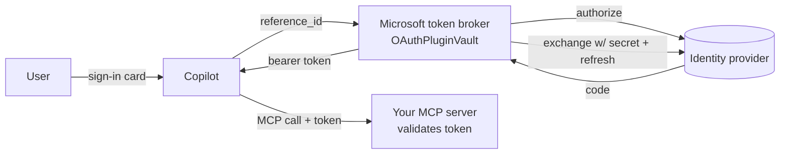

# Security & login

Everything you need to decide **how users sign in** to a Microsoft 365 Copilot MCP
plugin — the concepts, the options, the two registrations people confuse, and the
recommended pattern for an ISV. The step-by-step runbooks are linked at the end.

---

## The mental model

A Copilot MCP plugin does **not** run OAuth itself. When the plugin manifest says
`auth.type = OAuthPluginVault`, Copilot delegates sign-in to **Microsoft's token
broker** (the Bot Framework Token Service). The broker:

1. shows the sign-in card and redirects the user to the IdP's **authorize** URL,
2. exchanges the returned code for a token **server-side, using your client
   secret** (the secret never touches Copilot or the user),
3. **caches and refreshes** the token, and attaches it as a **bearer token** to
   every MCP call.

Your MCP server's job is just to **validate that bearer token** and gate `/mcp`.



This is why **one user consent, then silent** is the normal, healthy experience:
the IdP remembers the grant and the broker refreshes the token.

---

## The two registrations people confuse

You generally need **both**, in **two different systems**:

| | Entra app registration | Teams Developer Portal (TDP) OAuth client registration |
|---|---|---|
| System | **Entra ID** (the IdP) | **Microsoft token broker** |
| Answers | *who is the OAuth client?* (client id, secret, redirect, scopes) | *how does Copilot get a token?* (puts the client id+secret+endpoints in the broker's vault) |
| Produces | an app id + secret | a **`reference_id`** GUID |
| Lives in | wherever you register the app | the **M365 tenant** where the agent runs |

The Entra app alone is only half of OAuth ("who is asking"). The TDP registration is
the other half ("who runs the dance and holds the secret"). The `reference_id` it
produces goes into `ai-plugin.json` as `auth.reference_id`. (It encodes the tenant:
it decodes to `{tenant-guid}##{registration-guid}`.)

> If your IdP is not Microsoft (GitHub, Okta, Pega STS, …) you skip the *Entra app*
> half and just register that IdP's client id/secret/endpoints in TDP.

---

## Three modes (pick one)

### 1. Anonymous
No auth. The widget renders, tools work, and the **MCP server can still authenticate
to your real backend on its own** (server-side). Best for demos and for backends
that don't need the *user's* identity. Set `PEGA_MCP_REQUIRE_AUTH=false`.

### 2. Generic OAuth 2 — recommended for ISVs
Point the TDP OAuth registration at **any RFC 6749 provider**: your own STS (Pega,
Okta, Auth0), GitHub, or **Entra-as-generic** (below). These usually return
**opaque** tokens, so the server validates by calling the IdP's **userinfo**
endpoint (`server/pega_mcp/auth.py → make_userinfo_validator`). Configure:

```
PEGA_MCP_REQUIRE_AUTH=true
PEGA_MCP_AUTH_MODE=generic
PEGA_MCP_OAUTH_USERINFO_URL=<your IdP userinfo URL>
```

No app registration or admin consent in the **customer's** Microsoft tenant — the
identity lives at *your* IdP. This is the pattern that matches how an ISV's users
actually sign in (into the ISV's product, not into Microsoft).

#### Entra-as-generic — Microsoft identity, GitHub-level simplicity
You can keep **Microsoft identity** while avoiding all the SSO plumbing, by pointing
the *generic* registration at Entra's plain endpoints with **user-consentable Graph
scopes**:

| TDP field | Value |
|---|---|
| Authorization | `https://login.microsoftonline.com/common/oauth2/v2.0/authorize` |
| Token / Refresh | `https://login.microsoftonline.com/common/oauth2/v2.0/token` |
| Scope | `openid profile offline_access User.Read` |
| Client id / secret | a **multi-tenant** Entra app |

Server validates the resulting Microsoft Graph token via Graph `/me`:

```
PEGA_MCP_AUTH_MODE=generic
PEGA_MCP_OAUTH_USERINFO_URL=https://graph.microsoft.com/v1.0/me
```

Because `User.Read` + `openid`/`profile`/`offline_access` are **user-consentable**,
a user from any tenant signs in via `/common`, consents **once** (no admin), and a
service principal is auto-created in their tenant as part of that consent.
**No admin consent, no token-store preauthorization, no per-tenant provisioning,
multi-tenant out of the box.** This is the sweet spot. Full steps:
[auth-generic-oauth.md](auth-generic-oauth.md).

### 3. Entra ID SSO
The deepest Microsoft integration: an app-specific scope
(`api://<app>/access_as_user`), the Microsoft enterprise token store
pre-authorized, and a Teams **Entra SSO** registration. It enables silent SSO for a
tenant's own users but typically requires **admin consent** and per-tenant
provisioning. Full steps: [auth-runbook.md](auth-runbook.md).

---

## Consent: two different things called "consent"

| | Per-user IdP consent | Tenant admin consent |
|---|---|---|
| Who | the end user, once | a tenant **admin**, per tenant |
| Where | at the IdP (the standard "Authorize" / Microsoft consent screen) | the Microsoft/Entra tenant |
| Effort | one click, then silent | app provisioning + admin grant |
| Triggered by | any sign-in | app-specific Entra scopes / SSO |

The pleasant "click once, done forever" is the **per-user** kind. The painful kind
is **tenant-admin**, and you only incur it with **Entra app-specific scopes / SSO**.
Generic OAuth (including Entra-as-generic) stays in the user-consent lane.

---

## Server-side validation

`server/pega_mcp/auth.py` is **pure-Python** (no `cryptography`/`PyJWT`), so it
builds in any slim container:

- **Entra mode** — verifies the JWT: RS256 signature against the tenant JWKS
  (RSA verify via `pow(s, e, n)` + EMSA-PKCS1-v1_5), issuer, audience, `exp`/`nbf`,
  `tid`, and optional scope. Supports single-tenant (a GUID) or multi-tenant
  (`common`/`organizations`, validating each token against its own tenant, with an
  optional allowlist).
- **Generic mode** — calls the IdP's userinfo endpoint with the token; `200` means
  the token is live and the IdP vouches for the identity. Caches briefly (a single
  widget render makes several calls). Optional subject allowlist.

A pure-ASGI `BearerAuthMiddleware` gates only `/mcp` (health/exports stay public),
returns a clean `401` with `WWW-Authenticate: Bearer`, and never buffers MCP's
streaming responses. Everything is behind `PEGA_MCP_REQUIRE_AUTH`, so you can ship
anonymous and flip auth on later with no code change.

---

## Distribution: sideload vs. publish

The TDP registration's `reference_id` is **baked into the app package**. Who does the
registration — and how often — depends on how you distribute:

- **Sideload (custom-app upload)** is a dev/test path. Each tenant uploads its own
  copy (often with a fresh app id), so you end up registering **per tenant/upload**.
  This is the friction most people hit while testing.
- **Publish** (org catalog or the Microsoft commercial marketplace) gives the app a
  **single stable identity**. You register the OAuth client **once**, bind it to the
  published app, and every customer installs the **same** package — inheriting that
  one registration. Customers' users just consent once.

So the "register per customer" pain is an artifact of **sideloading to test**, not of
the model an ISV would actually ship. For production: build once, **publish**, and
customers install + consent.

> Sideloading itself must be enabled in a tenant (Teams admin → setup policies →
> *Upload custom apps*). Fresh dev tenants disable it by default — that's a tenant
> governance setting, independent of auth.

---

## Operational notes (hard-won)

- **Cold starts break auth tests.** On scale-to-zero hosts, the first MCP call can
  time out before the container warms. Use `min-replicas=1`.
- **Don't churn config during a live test.** Every app-setting change restarts the
  container; a restart mid-test looks like an auth failure but isn't.
- **A blank sign-in redirect** usually means the code→token exchange failed — check
  the TDP **client secret** and the **endpoints**, and confirm the IdP's redirect
  allow-list includes `https://teams.microsoft.com/api/platform/v1.0/oAuthRedirect`.
- **`GET /mcp` returning 406** is normal (a bare GET without the MCP accept header);
  it is not an auth error.

---

## Runbooks

- [auth-generic-oauth.md](auth-generic-oauth.md) — generic OAuth 2, GitHub demo, and
  **Entra-as-generic** (recommended).
- [auth-runbook.md](auth-runbook.md) — full Entra ID SSO variant.
